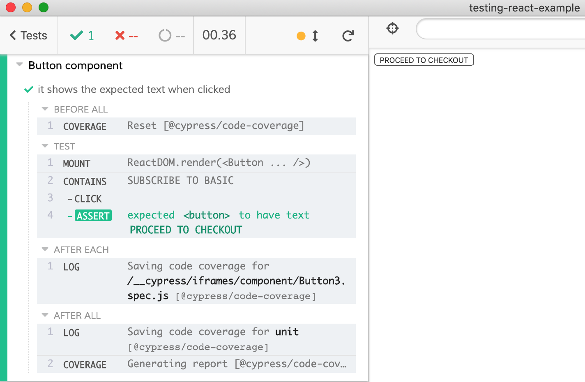

React component testing example

- uses [cypress-react-unit-test](https://github.com/bahmutov/cypress-react-unit-test)
- read [My vision for component testing](https://glebbahmutov.com/blog/my-vision-for-component-tests/)

See spec files in [src](src) folder.

Example

```js
import React, { useState } from "react";
import { mount } from "cypress-react-unit-test";

function Button(props) {
  const [text, setText] = useState("");
  function handleClick() {
    setText("PROCEED TO CHECKOUT");
  }
  return <button onClick={handleClick}>{text || props.text}</button>;
}

describe("Button component", () => {
  it("it shows the expected text when clicked", () => {
    mount(<Button text="SUBSCRIBE TO BASIC" />);
    cy.contains('SUBSCRIBE TO BASIC')
      .click()
      .should('have.text', 'PROCEED TO CHECKOUT')
  });
});
```


